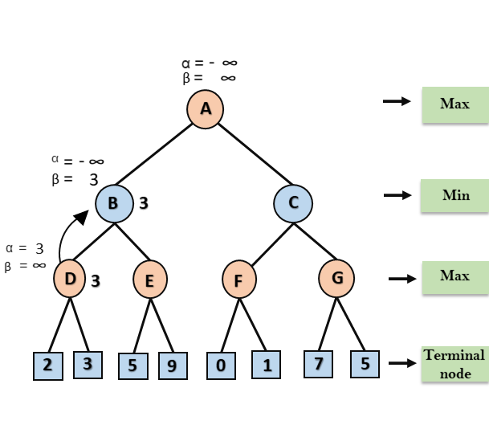

# sherlock_go

This is Computer Games code for Amazon Games. The code won the 2021 CCGT Runner_up.


## How to Use

- Operation System: Windows 7,8,10

- Software: Visual Studio


```
run sherlock_go/amazon_sherlockgo.sln
```

## Basic Strategy

- alpha-beta pruning & recursive.

